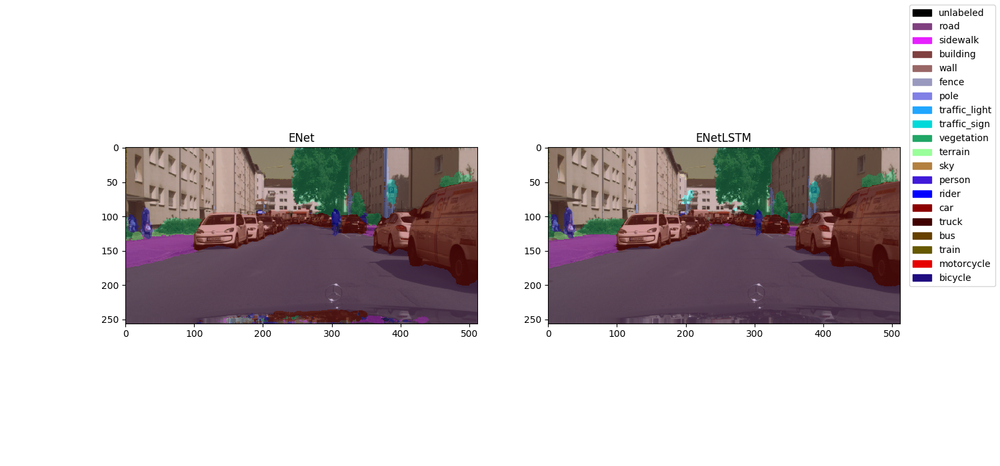

# semantic-video-segmentation
Enhancing temporal consistency in semantic video segmentation, using recurrent neural networks.

This repository contains a deep learning framework based on PyTorch, for semantic video segmentation. It implements 
the work of my [master thesis](thesis-temporal-video-consistency.pdf). It offers:
- Dataloaders for loading images, video files and image sequences (videos stored as individual image files).
- Convolutional recurrent network layers like the convLSTM and convGRU. 
- Some (pretrained) network architectures for real-time semantic image/video segmentation, like 
    [ENet](https://arxiv.org/abs/1606.02147v1), ENetLSTM and ENetGRU (=ENet with recurrent layer inserted between 
    encoder and decoder).
- Loss functions encouraging RNNs to learn temporal consistency, like the change, smoothing and 
    [warping](http://openaccess.thecvf.com/content_ECCV_2018/html/Wei-Sheng_Lai_Real-Time_Blind_Video_ECCV_2018_paper.html) 
    loss.
- Evaluation metric to evaluate the temporal consistency of consecutive segmentations: the temporal IoU.
- A framework that allows plug-and-play of all thesis items, and that is easily extendable.

More information of the theory behind these implementations can be found in the master thesis file: 
    [thesis-temporal-video-consistency.pdf](thesis-temporal-video-consistency.pdf).

## Requirements
- Python 3.7 (not tested with earlier versions)
- See requirements.txt  (TODO remove unnecessary ones)

## Usage

First, download (one of) the datasets:
- CamVid:
[download link for images](https://github.com/alexgkendall/SegNet-Tutorial/tree/master/CamVid), 
[download link for videos](http://mi.eng.cam.ac.uk/research/projects/VideoRec/CamVid/).
- Cityscapes: 
[download link](https://www.cityscapes-dataset.com/).

Then, update the dataset configuration file `data/dataset/config.py` to match your directory structure.

### Training a network:
For more info about arguments:
```bash
python train.py --help
```
Example:
```bash
python train.py -c config/enetlstm-cityscapes/ksize3-concat_cuda.json --cuda
```
The training results will appear under saved/<config_name>/. 

To use a specific GPU, put `CUDA_VISIBLE_DEVICES=<device index>` in front of the command. 

### Evaluating a network: 
For more info about arguments: 
```bash
python evaluate.py --help
```
Example: 
```bash
python evaluate.py config/visualize/cityscapes-enet-enetlstm.json -v -t 0.1 --cuda
```
The `-v` option visualizes the network(s) on the videos or images in the dataset, as specified in the config file. 
The `-t` option sets the framerate. 
To quit the visualization environment, press `q`. Example: 



## References

- Code structure is based on [Pytorch template from Victor Huang](https://github.com/victoresque/pytorch-template).
- ENet is heavily based on the [ENet implmenetation of David Silva](http://www.dropwizard.io/1.0.2/docs/).
- ConvLSTM is heavily based on the [ConvLSTM implementation of Andrea Palazzi](https://github.com/ndrplz/ConvLSTM_pytorch/blob/master/convlstm.py).
- ConvGRU is heavily based on the [ConvGRU implementation of Jacob Kimmel](https://github.com/jacobkimmel/pytorch_convgru/blob/master/convgru.py).
